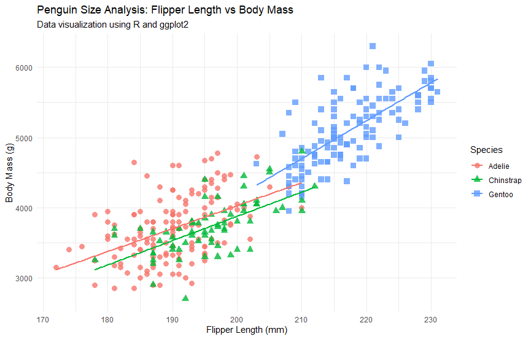

# Palmer Penguins Data Visualization Project 🐧

## Project Overview
This project provides a statistical analysis of the Palmer Penguins dataset using the **R programming language**. The goal is to explore the biological relationship between flipper length and body mass across three different penguin species (Adelie, Chinstrap, and Gentoo).

## Tools & Libraries Used
- **RStudio**: Integrated Development Environment (IDE).
- **ggplot2**: For creating high-quality, layered visualizations.
- **dplyr & tidyr**: For data manipulation and cleaning.

## Key Insights
The visualization clearly shows a positive correlation between flipper length and body mass. Among the three species:
- **Gentoo** penguins tend to be the largest in terms of both body mass and flipper length.
- **Adelie and Chinstrap** penguins show similar physical clusters, though they remain distinct.

## How to Run the Code
1. Clone this repository.
2. Install the required packages: `install.packages(c("palmerpenguins", "tidyverse"))`.
3. Run the `analysis.R` script.

## Visualization

---
**Developed by: Ali Sultan** *Data Analytics Professional | Python & SQL Enthusiast*
